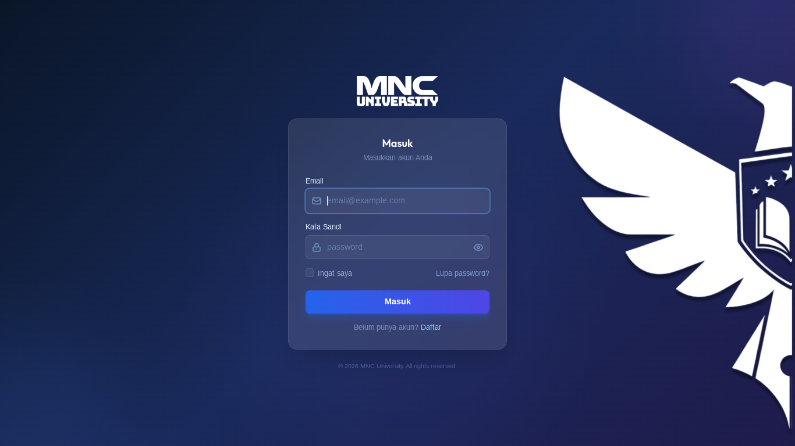
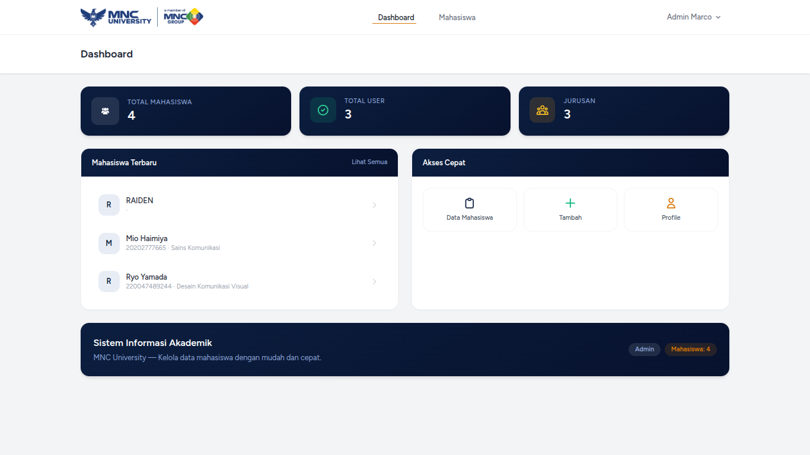
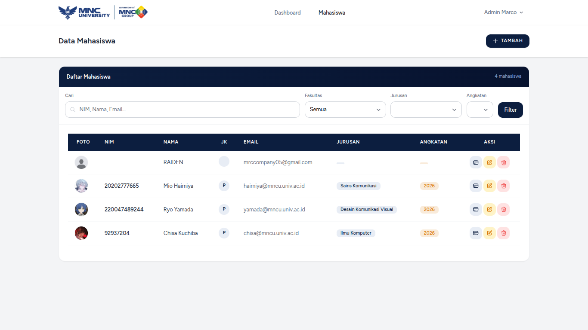

# Sistem Informasi Akademik — MNC University

App web buat kelola data mahasiswa pake Laravel 13, ada login-nya, verifikasi email pake kode OTP, ada role admin sama user, terus kalau hapus data mahasiswa itu gak bener-bener ilang (soft delete, tetep nyangkut di database wkwk).

> **Landing page:** "moga gak error :V" — semoga aja pas penguji nyobain gak error wkwk

---

## 📌 Daftar Isi

- [Teknologi yang Dipakai](#-teknologi-yang-dipakai)
- [Akun yang Tersedia](#-akun-yang-tersedia)
- [Cara Menjalankan](#-cara-menjalankan)
- [Cara Kerja Sistem](#-cara-kerja-sistem)
- [Struktur Database](#-struktur-database)
- [Hak Akses & Route](#-hak-akses--route)
- [Fitur Autentikasi](#-fitur-autentikasi)
- [Fitur CRUD Mahasiswa](#-fitur-crud-mahasiswa)
- [Fitur Unggah Foto](#-fitur-unggah-foto)
- [Penjelasan Test Case](#-penjelasan-test-case)

---

## 🔧 Teknologi yang Dipakai

| Komponen | Keterangan |
|---|---|
| **Framework** | Laravel 13.23.0 |
| **Bahasa** | PHP 8.3, JavaScript (vanilla + Alpine.js) |
| **Database** | SQLite |
| **CSS** | Tailwind CSS (via Vite) |
| **Template Engine** | Blade |
| **Frontend Scaffolding** | Laravel Breeze (Blade + Alpine.js) |
| **Image Cropper** | Cropper.js v1.6.2 |
| **Build Tool** | Vite (npm) |
| **Mail (lokal)** | `MAIL_MAILER=log` → OTP ditulis ke `storage/logs/mail.log` |
| **Session** | Database driver (`sessions` table), lifetime 5 menit |

---

## 👤 Akun yang Tersedia

Ada **1 akun admin** yang sudah dibuat. Buat akun user baru lewat halaman **Register** di aplikasi.

| Role | Email | Password |
|---|---|---|
| **Admin** | `admin@mncu.univ.ac.id` | `jawa1234` |

> Akun admin dibuat otomatis via `DatabaseSeeder` atau langsung ada di `database.sqlite` yang sudah ke-push. Kalau mau tambah user, tinggal daftar lewat halaman Register (nanti role-nya otomatis jadi `user`).

---

## 🚀 Cara Menjalankan

```bash
# 1. Clone repo
git clone https://github.com/IKInecro/idk-crud.git
cd idk-crud

# 2. Install dependencies
composer install
npm install

# 3. Siapkan environment (sudah ada APP_KEY yang sesuai)
cp .env.example .env

# 4. Generate key kalau .env sudah diubah (atau pakai yang ada di .env.example)
php artisan key:generate

# 5. Build frontend
npm run build

# 6. Link storage (buat akses foto upload)
php artisan storage:link

# 7. Jalankan migrasi + seeder (pakai ini kalau mau database fresh)
php artisan migrate --seed

# 8. Jalankan server
php artisan serve
```

Buka `http://localhost:8000`.

> **Catatan:** Repo ini sudah menyertakan file `database/database.sqlite` yang berisi data test. Jadi aplikasi **langsung bisa dipakai tanpa migrate**. Kalau mau database bersih/reset, hapus file sqlite lalu jalankan `php artisan migrate --seed`.

---

## 🧠 Cara Kerja Sistem

1. **User daftar** lewat `/register` → sistem otomatis buat 2 record: satu di tabel `users` (akun login) dan satu di tabel `mahasiswas` (profil mahasiswa yang link via `user_id`). Field akademik (jurusan, angkatan, dll) kosong dulu.
2. Setelah daftar, user harus **verifikasi email pakai OTP 6 digit**. OTP dikirim ke log (`storage/logs/mail.log`) karena pakai `MAIL_MAILER=log` (localhost, bukan mailtrap hehe).
3. User yang belum verifikasi hanya bisa akses halaman verifikasi. Dashboard & data mahasiswa butuh `auth` + `verified`.
4. User biasa bisa **lengkapi profil mahasiswa**-nya di halaman Profile (isi NIM, jurusan, dll).
5. **Admin** bisa tambah/edit/hapus data mahasiswa apa pun.
6. Hapus pakai **soft delete** → data tetap ada di DB, cuma `deleted_at` terisi.

---

## 🗄️ Struktur Database

Tabel utama (10 total):

| Tabel | Fungsi |
|---|---|
| `users` | Akun login (name, email, password hash, `role`, `verification_code`) |
| `mahasiswas` | Data mahasiswa (nim, nama, jurusan, dll) + `user_id` (link ke users) + `created_by` + `deleted_at` (soft delete) + `alamat` (terenkripsi) |
| `sessions` | Session login (driver database) |
| `password_reset_tokens` | Token reset password |
| `cache`, `cache_locks`, `jobs`, `job_batches`, `failed_jobs` | Template bawaan Laravel (tidak dipakai aktif) |
| `migrations` | Riwayat migration |

### Relasi
- `User` **hasOne** `Mahasiswa` (lewat `mahasiswas.user_id`)
- `Mahasiswa` **belongsTo** `User`

### Kolom `mahasiswas`
`id, nim, nama, email, jurusan, angkatan, tgl_lahir, alamat, foto, created_by, created_at, updated_at, deleted_at, user_id, jenis_kelamin`

---

## 🔐 Hak Akses & Route

| Path | Method | Siapa yang Bisa |
|---|---|---|
| `/` | GET | **Publik** (landing page) |
| `/login`, `/register`, `/forgot-password`, `/reset-password/*` | GET/POST | **Publik** (guest) |
| `/verify-email` + `/verify-email/otp` | GET/POST | **Sudah login, belum verifikasi** |
| `/dashboard` | GET | **Login + terverifikasi** |
| `/profile`, `/profile/mahasiswa` | GET/PATCH | **Login + terverifikasi** |
| `/mahasiswa` (list), `/mahasiswa/{id}` (detail) | GET | **Semua yang login + terverifikasi** (view-only utk user biasa) |
| `/mahasiswa/create`, `/mahasiswa` (store) | GET/POST | **Hanya Admin** (via policy) |
| `/mahasiswa/{id}/edit`, `/mahasiswa/{id}` (update/delete) | GET/PUT/DELETE | **Hanya Admin** (via policy) |
| `/logout` | POST | **Semua yang login** |

> Non-admin yang paksa akses `/mahasiswa/create` dkk akan dapat **403**.
>
> Yang belum login akses halaman terlindungi → diarahkan ke `/login` otomatis oleh middleware `auth`. Abis login, balik lagi ke halaman yang tadi mau dibuka (`redirect()->intended()`).

---

## ✉️ Fitur Autentikasi

- **Register** → auto-login + generate OTP 6 digit
- **Verifikasi OTP** → cocokkan dengan `users.verification_code`, lalu set `email_verified_at`
- **Login** → pesan error generik "Email atau password salah." (tidak bocorin email terdaftar atau enggak)
- **Rate limit login** → 5 kali percobaan per menit per email+IP, abis itu lockout 1 menit
- **Logout** → konfirmasi dulu ("Yakin Mau Logout?") → redirect ke `/login`
- **Session** → kadaluarsa setelah 5 menit (SESSION_LIFETIME=5)

---

## 📋 Fitur CRUD Mahasiswa

### Create (Tambah)
- Field **wajib**: NIM (unik), Nama, Jenis Kelamin (L/P), Email (unik), Jurusan, Angkatan (dropdown 2021–2026), Tanggal Lahir (harus sebelum hari ini)
- Field **opsional**: Alamat, Foto

### Update (Edit)
- Validasi sama seperti create, tapi `unique` di-ignore untuk data sendiri (biar NIM/email sendiri gak dianggap duplikat)
- Kalau field wajib dikosongkan → ditolak, data lama tetap tersimpan

### Delete (Hapus)
- Modal konfirmasi (Batal / Ya, Hapus)
- **Soft delete** → `deleted_at` terisi, data tetap ada di DB (lihat TC-DEL-04)

### Filter & Pencarian
- Live search (NIM, nama, email, jurusan, angkatan) + filter fakultas, jurusan, angkatan — semuanya via AJAX tanpa reload

### Kartu Mahasiswa (ID Card)
- Tombol kartu di tiap baris → popup ID card (foto, NIM, nama, tgl lahir, alamat, **kelamin**, jurusan, angkatan, status AKTIF)

---

## 🖼️ Fitur Unggah Foto

- Pakai **Cropper.js**: pilih foto → crop → konfirmasi
- File **> 2MB ditolak langsung di browser** (alert sebelum di-crop) — validasi ganda di server juga ada (`max:2048`)
- Format: jpg, jpeg, png

---

## 📝 Penjelasan Test Case

Seluruh test case (TC-LGN-01 s/d TC-DEL-05) sudah **diuji manual satu per satu dan berhasil** ✅

> **Catatan:** Beberapa test case ternyata **sama/mirip**, jadi ada yang diuji sekaligus:
> - **TC-INP-03** (nilai unik sudah terdaftar saat input) dan **TC-EDT-04** (nilai unik jadi duplikat saat edit) → intinya sama-sama diuji validasi `unique`.
> - **TC-INP-07** (membatalkan proses input) dan **TC-EDT-06** (membatalkan proses edit) → intinya sama-sama diuji "tidak disimpan kalau form gak di-submit".

### 🔍 Detail TC-DEL-04 (Soft Delete)

Setelah hapus lewat aplikasi, data **TIDAK benar-benar hilang** dari database. Cuma kolom `deleted_at` yang terisi tanggal hapus.

Cara buktiin:

```bash
# Di Laravel Tinker
php artisan tinker

# Lihat semua termasuk yang terhapus
App\Models\Mahasiswa::withTrashed()->get();

# Hanya yang terhapus
App\Models\Mahasiswa::onlyTrashed()->get();
```

```sql
-- Langsung di SQLite
SELECT * FROM mahasiswas WHERE deleted_at IS NOT NULL;
```

Contoh nyata di DB yang ke-push:
```
15 | 9999 | lutfi | aisdhad@gmail.co | deleted_at=2026-07-31 09:33:40
```

Data ini **tidak tampil di daftar utama** (query otomatis filter `deleted_at IS NULL`), tapi **masih tersimpan** di tabel `mahasiswas`.

- Restore: `App\Models\Mahasiswa::withTrashed()->find(15)->restore()`
- Hapus permanen (hard delete): `App\Models\Mahasiswa::withTrashed()->find(15)->forceDelete()`

---

## 📂 Struktur Folder Utama

```
app/Http/Controllers/Auth/    → Register, Login, Verifikasi OTP
app/Http/Controllers/MahasiswaController.php → CRUD mahasiswa
app/Http/Controllers/ProfileController.php   → Profil + sync email + hapus akun
app/Http/Requests/            → Validasi create/update & login
app/Models/                   → User, Mahasiswa (SoftDeletes)
app/Policies/MahasiswaPolicy.php → Aturan akses admin vs user
resources/views/              → Blade (auth, mahasiswa, profile, dashboard)
resources/views/errors/       → Halaman error 403/404
routes/web.php & auth.php     → Definisi route
database/migrations/          → Skema tabel
database/seeders/             → Seeder admin + mahasiswa
public/images/                → Asset (logo, dll)
```

---

## 📸 Screenshot Area







---

frontend yang bikin lama ni projek mas :V , backend mah bentar ini
